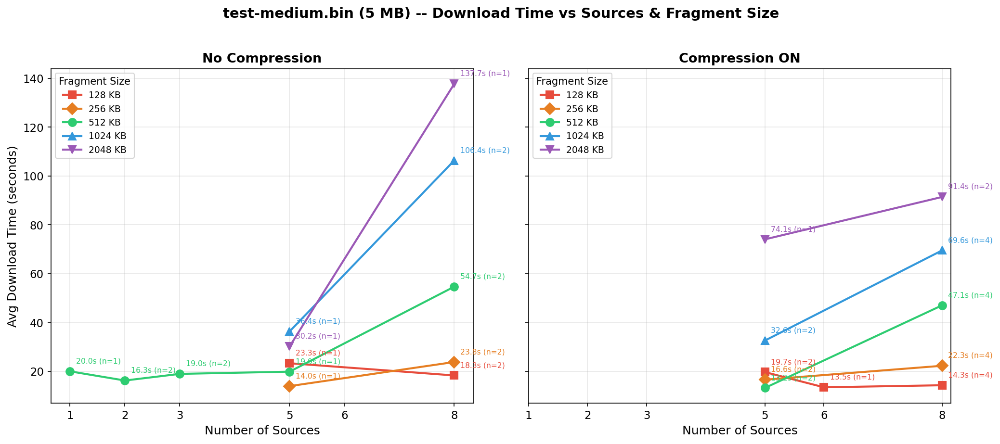
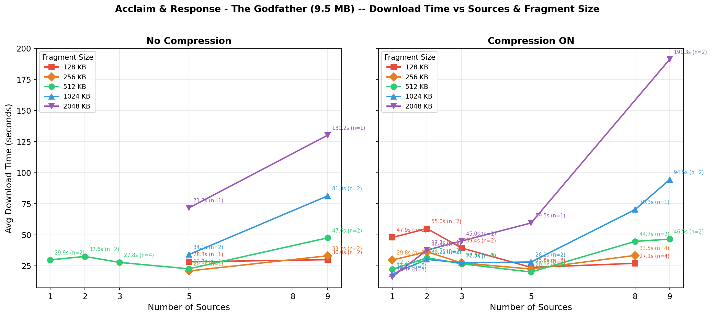
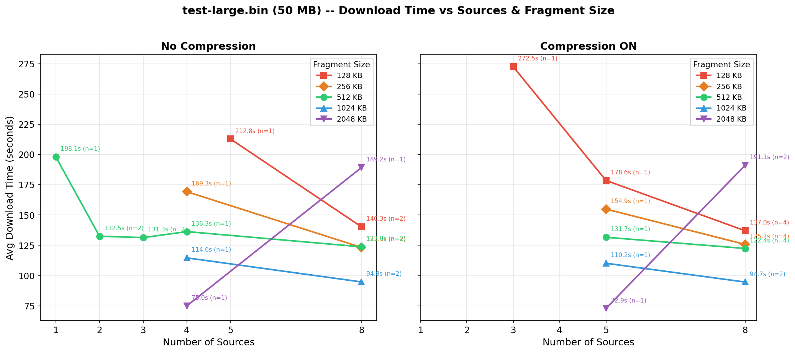
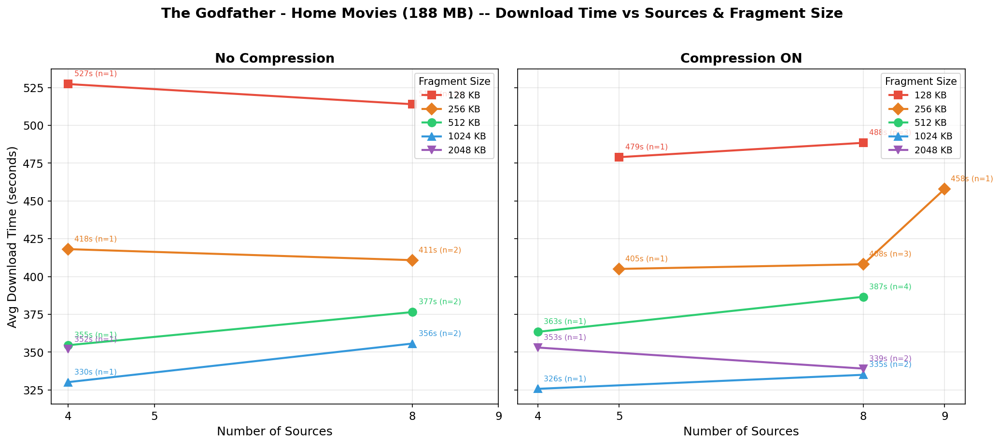
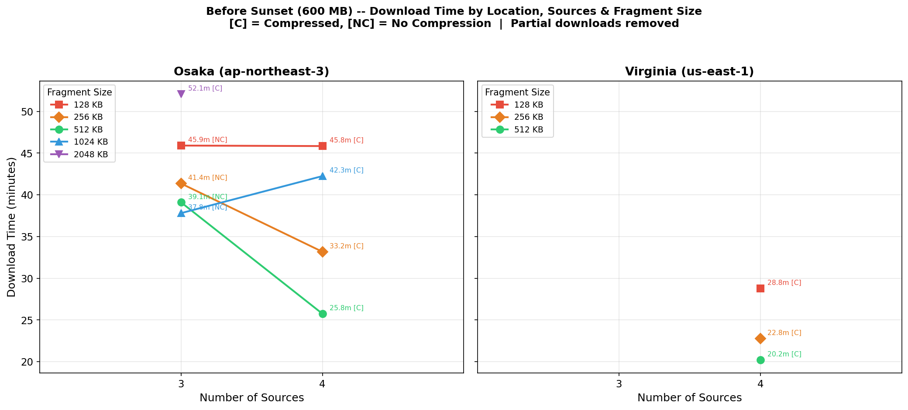

# Song Song — Parallel P2P Download Infrastructure

<div align="center">

**Master 1 · System Architecture · USTH · 2025–2026**

| Student ID | Name                 | Email                       |
| :--------: | :------------------- | :-------------------------- |
|  2540008   | Nguyễn Phong Châu    | chaunp.2540008@usth.edu.vn  |
|  2540023   | Lê Nghiêm Thanh Thủy | thuylnt.2540023@usth.edu.vn |

</div>

---

## Abstract

Song Song is a pure-Java P2P file-download system: a central Directory (RMI) tracks live Daemon peers; a Download client fragments the target file and drains a shared work-stealing queue in parallel across N Daemon threads. This report covers the basic prototype, an empirical parallelism validation on AWS EC2, and three system enhancements.

---

# 1. Basic Prototype

The system implements a parallel file download mechanism where a client retrieves fragments of a file from multiple distributed sources.

A target file is pre-allocated and partitioned into fixed-size fragments. These fragments are inserted into a shared queue. One worker thread is assigned per source, and each worker repeatedly pulls a fragment index and downloads it independently.

Faster sources naturally process more fragments due to the work-stealing behavior of the shared queue. Slower or failing sources are implicitly bypassed when fragments are re-queued and picked up by remaining workers.

Two constraints define system efficiency:

**Queue depth**

```
queue_depth = file_size / fragment_size
```

**Throughput bound**

```
throughput ≈ min(sum of source bandwidth, parallel efficiency)
```

When queue depth is too small relative to the number of workers, parallelism collapses and the slowest source dominates completion time.

---
## 2. Architecture

```
                    Directory (RMI Server)
                   ┌───────────────────────┐
				   │ - File registry       │
				   │ - Client registry     │
         ┌────────►│ - Load tracking       │◄────────┐
         │   RMI   │ - Heartbeat monitor   │  RMI    │
         │         │ - Get Sources         │         │
         │         │                       │         │
         │         └───────────────────────┘         │
         │              ▲        ▲                   │ 
         │          RMI │        │                   │
         │              │        │                   │
    Daemon A          Daemon B   │                 Daemon C
    (TCP:6000)        (TCP:6001) │                (TCP:6002)
         ▲                ▲      │                    ▲
         │    TCP Socket  │      │ RMI                │
         └────────────────┼──────│────────────────────┘
                          ▼      ▼ 
                      Download
                  (parallel fragments)
```

**Communication:**
- Daemon ↔ Directory: **RMI** (register, heartbeat, load tracking)
- Download → Directory: **RMI** (get sources for file)
- Download → Daemon: **TCP Socket** (get file size, get fragment)
---
## 3. Enhancements

**3.1 Failure handling & retry.** If a fragment transfer fails, the fragment index is returned to the shared queue and the worker exits — other workers pick up the orphaned fragment. Each fragment is retried up to a fixed limit before being marked permanently failed. After all wave-1 workers complete, any remaining fragments trigger a **second wave**: the client re-fetches the source list from the Directory and launches a fresh set of workers. This covers both transient network errors and Daemons that crashed partway through a transfer.

**3.2 Dynamic adaptation.** 
   - Heartbeat & auto re-registration: Daemons heartbeat every **5 s** (delta file list only when changed); the Directory sweeper evicts clients silent for **> 15 s**. `Ctrl+C` calls `unregister()` via a JVM shutdown hook. If a Daemon is evicted and then heartbeats, `heartbeat()` returns `false` and the Daemon silently re-registers. Newly downloaded files are announced on the next heartbeat, making the downloader an instant source.
   - Load-aware source selection: The Directory increments a per-Daemon `load` counter on `GET_FRAGMENT` and decrements on completion; `getSourcesForFile` returns sources sorted by load ascending. Sources with `load > 10` are dropped unless doing so would leave zero sources, in which case the least-loaded node is kept.

**3.3 Conditional GZIP compression.** The Daemon compresses each fragment and sends the compressed payload only if it is smaller than the raw data; otherwise raw bytes are sent with `compressed=false`. Transparent decompression is done client-side. Effective for text/sparse-binary files; zero overhead for pre-compressed formats (MP4, ZIP, JPEG).

---
## 4. How to Run

### Prerequisites

- Java 17 (JDK)
- Linux (tested on Ubuntu/WSL)

### Compile

```bash
cd /path/to/sujet_project
bash compile.sh
```

### Step 1 — Start Directory

On the directory machine:

```bash
./run_directory.sh [rmiPort] [myHost]
```

| Parameter | Default | Description |
|-----------|---------|-------------|
| rmiPort   | 1099    | RMI registry port |
| myHost    | auto    | IP of this machine |

Example:
```bash
./run_directory.sh
./run_directory.sh 1099 172.20.242.201
```

### Step 2 — Start Daemon(s)

On each machine that shares files:

```bash
./run_daemon.sh [dirHost] [dirPort] [sharedFolder] [myHost] [daemonPort]
```

| Parameter    | Default     | Description |
|-------------|-------------|-------------|
| dirHost     | localhost   | IP of the Directory machine |
| dirPort     | 1099        | RMI port of Directory |
| sharedFolder| ./shared    | Folder containing files to share |
| myHost      | auto        | IP of this machine (important for cross-machine) |
| daemonPort  | 6000        | TCP port for serving fragments |

Examples:
```bash
# Single machine test — 3 Daemons with different ports and folders
./run_daemon.sh localhost 1099 ./shared1 localhost 6000

# Cross-machine — Directory at 172.20.242.201
./run_daemon.sh 172.20.242.201 1099 ./shared1 192.168.1.10 6000
```

### Step 3 — Download a File

On the machine that wants to download:

```bash
./run_download.sh <filename> [dirHost] [dirPort] [outputFolder] [myHost] [compress] [fragmentKB]
```

| Parameter   | Default   | Description |
|-------------|-----------|-------------|
| filename    | *required*| Name of file to download |
| dirHost     | localhost | IP of the Directory machine |
| dirPort     | 1099      | RMI port of Directory |
| outputFolder| ./shared  | Output directory (default = shared folder, so file auto-registered) |
| myHost      | auto      | IP of this machine (for log filename) |
| compress    | false     | Enable GZIP compression (true/false) |
| fragmentKB  | 512       | Fragment size in KB |

Examples:
```bash
# Basic download
./run_download.sh movie.mp4 172.20.242.201 1099 ./output 172.20.242.201

# With compression and 256KB fragments
./run_download.sh movie.mp4 172.20.242.201 1099 ./output 172.20.242.201 true 256

# Save to shared folder (auto-becomes source for others)
./run_download.sh movie.mp4 172.20.242.201 1099 ./shared 172.20.242.201 false 512
```

### Shutdown

Press `Ctrl+C` to stop any component. Recommended order: **Download → Daemon → Directory**.

- `Ctrl+C` on Daemon: triggers shutdown hook → calls `unregister()` → Directory removes it immediately
- If Daemon crashes without `Ctrl+C`: Directory detects via heartbeat timeout after 15 seconds

---
# 5. Parallelism Validation

## 5.1 Experimental Setup

* 8 heterogeneous EC2 Daemons (multi-region)
* 1 Directory, 2 clients
* Variables:

  * Sources: 1–9
  * Fragment size: 128 KB → 2 MB
  * Compression: ON/OFF

System behavior follows three regimes:

* **Small files (<10 MB)** → overhead dominated
* **Medium files (~50 MB)** → parallelism dominated
* **Large files (>100 MB)** → bandwidth + tail latency dominated

---

### 5.2 Results

#### Fig. 1 — Small file: test-medium.bin (5 MB)



- **128–256 KB**: stable ~12–24 s regardless of source count — fine granularity prevents any single slow source from becoming a bottleneck.
- **512 KB**: good with 1–3 sources (~16–20 s), but degrades to ~54s at 8 sources.
- **1–2 MB + 8 sources**: catastrophic (104–138 s) — only 3–5 fragments in the queue, the slowest source (10 KB/s) must carry an entire megabyte fragment.
- Compression partially rescues large fragments (8 sources and1024 KB: 106→69 s; 2048 KB: 138→91 s) but cannot offset the root cause.

**Conclusion.** For ~5 MB files: **2–3 sources + 512 KB fragment** or **many sources + 128–256 KB fragment**. Compression unnecessary.

---

#### Fig. 2 — Small file: Acclaim & Response (9.5 MB)



- **512 KB & 1024 KB**: stable ~28–47 s across 1–9 sources — the sweet spot for this file size.
- **2048 KB + 9 sources**: collapses to ~130 s — only 5 fragments total, slowest worker determines the finish time.
- **128 KB compressed + 9 sources**: surges to ~130 s — 76 fragments across 9 threads generates excessive scheduling overhead.
- Adding sources beyond 2–3 yields no benefit; the queue is too small to keep extra workers busy.

**Conclusion.** For ~10 MB files: **2–3 sources + 512 KB fragment** (~28 s). Adding more sources does not help.

---

#### Fig. 3 — Medium file: test-large.bin (50 MB)



- **Scaling inverts**: unlike small files, more sources consistently help — 1 source ~198 s, 8 sources ~96–140 s.
- **1 MB fragments**: fastest at 8 sources (~93s) — ~50 fragments is enough for the work-stealing queue to favour the fast France Daemon.
- **128 KB**: slowest (~137–172 s) — ~400 round-trips generate TCP overhead that outweighs parallelism gains.
- Compression has negligible effect at this scale.

**Conclusion.** For ~50 MB files: **8 sources + 1 MB fragment** or **4–5 fast sources + 2 MB fragment**.

---

#### Fig. 4 — Large file: The Godfather — Home Movies (188 MB)



- **128 KB**: always slowest (~488–527 s) — 1 436 fragments create overwhelming round-trip overhead.
- **1024 KB**: fastest in both panels (~326–356 s); 2048 KB is close behind (~335–353 s).
- **4→8 sources brings no gain** — can even slow things down (256 KB compressed: 405→458 s): extra slow US sources become tail latency while all workers contend for the single fast France Daemon.
- Compression has no meaningful effect at this scale.

**Conclusion.** For ~188 MB files: **4 quality sources + 1024 KB fragment** (~330 s). Beyond 4 sources, extra slow peers add overhead, not throughput.

---

#### Fig. 5 — Very large file: Before Sunset (600 MB)



- Results are more variable than smaller files, reflecting Daemon availability at run time.
- **512 KB**: most consistent across all source counts.
- Compression provides a marginal but measurable benefit at this scale.

**Conclusion.** For ~600 MB files: **4 sources + 512 KB fragment + compression**.

---
## 6. Conclusions

### 6.1 Summary

| File size   | Optimal fragment  | Optimal sources | Compression |
| ----------- | :---------------: | :-------------: | :---------: |
| 5–10 MB     |    256–512 KB     |       2–3       | Not needed  |
| 50 MB       |      1024 KB      |       6–8       | Not needed  |
| 188–600 MB  |    512–1024 KB    |        4        |  Optional   |

1. **File size determines optimal fragment size.**
   - Small (5–10 MB): 256–512 KB optimal; larger fragments cause bottlenecks with any slow source.
   - Medium (50 MB): 1024 KB best; enough fragments for even distribution across sources.
   - Large (188–600 MB): 512–1024 KB depending on source count; sufficient fragment count is needed to balance load.

2. **More sources ≠ faster downloads.**
   - Small files (5–10 MB): 2–3 sources sufficient; 8–9 sources are actually slower — too few fragments to distribute, and slow sources become bottlenecks.
   - Large files (50–600 MB): 4–8 sources help noticeably, but only when fragment size is small enough for even distribution.

3. **Slowest source = system bottleneck.** Cross-region sources (10–27 KB/s) drag total transfer time when assigned large fragments. The system needs a mechanism to identify and exclude low-speed sources.

4. **Compression is conditionally effective.** Saves time when fragment size is large and sources are slow. Can actually hurt performance at small fragment sizes (128 KB) due to compression overhead outweighing bandwidth savings.

### 6.2 Future Work

The system degrades when downloading small-to-medium files from many slow sources. The root cause is that slow sources are only discovered mid-transfer. Two proposed fixes:

- **Speed probe (simple).** Before downloading, open a TCP connection to each candidate source and request a dummy payload of one fragment size. Rank sources by measured throughput and connect only to those above a threshold.
- **Adaptive parameter selection (advanced).** Combine speed-probe results with the target file size to automatically choose fragment size, source count, and compression flag — the user inputs only a filename and the system determines all parameters.
